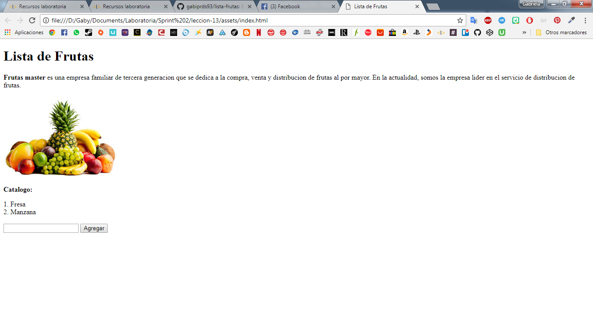

# lista-frutas
## Ejercicio evaluado
>Crear una lista ordenada de frutas y para agregar mas frutas a tu catalogo crea un input y un boton que nos facilitara añadir cualquier fruta que deseemos a la lista.
1. Se creo una funcion para imprimir las frutas
```javascript
function imprimir()
{
    var lista = "";
    for(var i = 0; i < frutas.length; i++)
    {
        lista += (i + 1) + ". " + frutas[i] + "<br>";
    }
    registro.innerHTML = lista + "<br>";
}
```
1. Pantalla final
